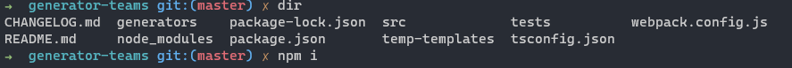
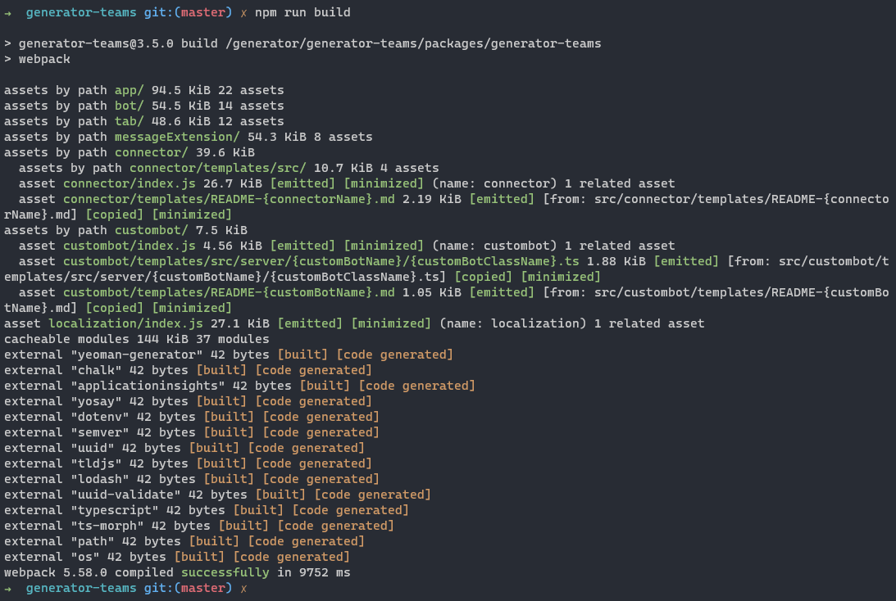
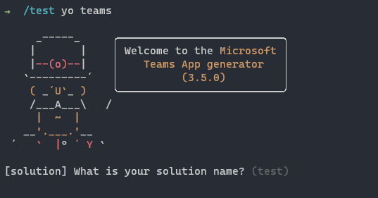
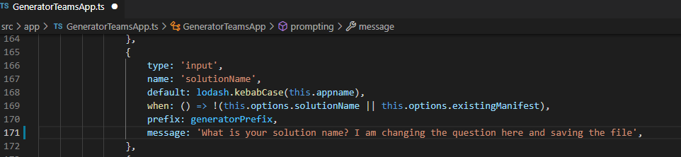
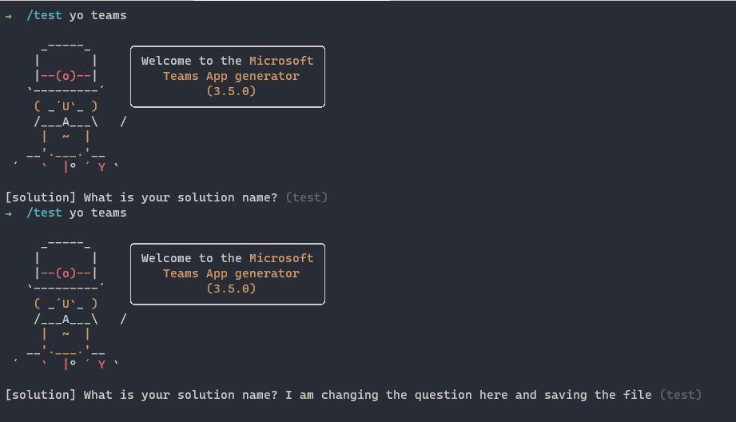
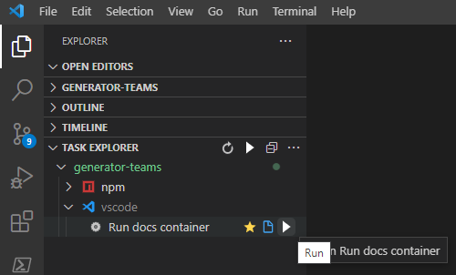
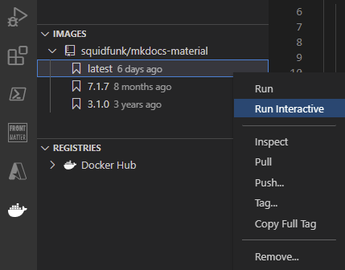

# Minimal Path to Awesome
The shortest way to prepare your local copy of the project for development and testing.

# Install prerequisites
Our prerequisites are the same as when you first [installed the Teams Generator](https://pnp.github.io/generator-teams/user-guide/setup-machine/)

# Get a local version of the Teams Generator
1. Fork this repository
2. Clone your fork
3. Navigate to the correct directory for the package you want to make a change to. The Teams generator is split into 3 different parts:
    - generator-teams
    - yoteams-build-core
    - yoteams-deploy
- in the command line:
    - run `npm i` to restore dependencies

    
    
    - run `npm run build` to build the project

    

    - run `npm test` to run unit tests (optional this can take a while)

If you installed the Generator globally using the `npm install generator-teams --global` command, we recommend that you uninstall it first, before running `npm link`    

run `npm link` to install the project locally. After linking the local package, we recommend that you create a empty folder in another drive where you can run the locally installed version of the Teams generator.

Now you can start with changing the generator code. (In this example we are changing the first question)

After changing the code, run the `npm run build` command to rebuild the project and see your changes integrated in the local version of the Teams generator.

> If you renamed files:

in the command line:
- run `npm run clean` to clean up the output folder
- run `npm run build` to rebuild the project
- run `npm link` to reinstall the project locally. Without this step, you will get an error, when trying to start the local version of the generator.

> Don't forget to add tests if you add logic.

# Documentation

The Microsoft Teams Generator uses [MkDocs](http://www.mkdocs.org/) to publish documentation pages. For simplicity, we recommend using the MkDocs Material Docker container which contains all dependencies installed.

### Preview docs using the Docker container
If you're using Visual Studio Code and have the Docker extension installed, you can run preview the docs using the container either by executing the `Run docs container` task, or, if you have pulled the image previously, from the Images pane by running the MkDocs container interactively. This article explains [working with Docker containers using VSCode](https://blog.mastykarz.nl/docker-containers-visual-studio-code-extension/) in more detail.

More information on how to use the Visual Studio Code extension please visit [the tutorial](https://docs.microsoft.com/en-us/visualstudio/docker/tutorials/docker-tutorial)

To run tasks easily from Visual Studio Code you can use the [Task explorer](https://marketplace.visualstudio.com/items?itemName=spmeesseman.vscode-taskexplorer). With this you can easily start the `run doc container`

Or you can start the docs container interactive, if you like to see the what's going on in an interactive screen. 

Alternatively, you can run the container in command-line:

- on macOS:
    - run `cd ./docs` to change directory to where the docs are stored
    - run `docker run --rm -it -p 8000:8000 -v ${PWD}:/docs squidfunk/mkdocs-material` to start the local web server with MkDocs and view the documentation in the web browser
- on Windows:
    - run `docker run --rm -it -p 8000:8000 -v c:/projects/cli-microsoft365/docs:/docs squidfunk/mkdocs-material` to start the local web server with MkDocs and view the    documentation in the web browser

### Preview docs using MkDocs installed on your machine.
If you want, you can also install MkDocs on your machine. See more information about installing MkDocs on your operating system at [http://www.mkdocs.org/#installation](http://www.mkdocs.org/#installation).

The Teams generator documentation currently uses mkdocs-material theme. See more information about installing mkdocs-material on your operating system at [https://squidfunk.github.io/mkdocs-material](https://squidfunk.github.io/mkdocs-material).

In order to run documentation locally, you can install MkDocs with pip (the Python package manager) then install the appropriate mkdocs-material version:

`pip install mkdocs mkdocs-material==7.1.7 pymdown-extensions==9.0`
Once you have MkDocs installed on your machine, in the command line:

run `cd ./docs` to change directory to where the docs are stored run `mkdocs serve` to start the local web server with MkDocs and view the documentation in the web browser