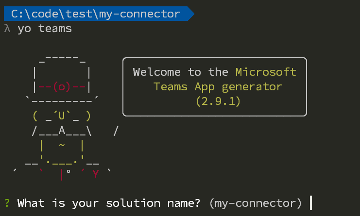
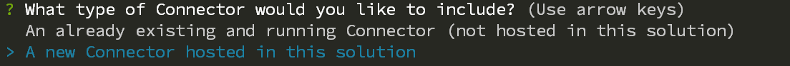
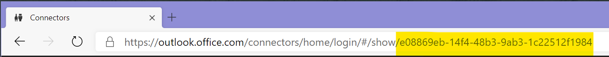
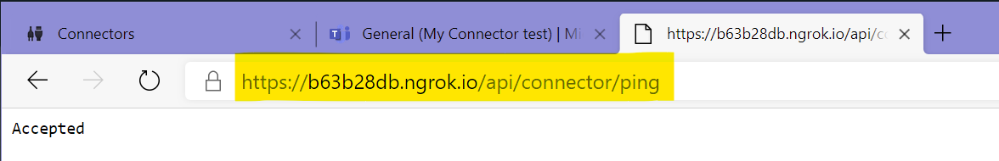

# Build a Connector for Microsoft Teams

> NOTE: Not updated with version `3.0.0` changes

In this tutorial we will walk through creating a Connector for Microsoft Teams using the Microsoft Teams Yeoman generator. It assumes that you have [enabled side-loading of Microsoft Teams apps](../user-guide/setup-tenant.md) in Microsoft Teams as well as have installed [all the prerequisites](../user-guide/setup-machine.md).

## Generate your project

In a command prompt create a new folder called `my-connector` where you will have your project files. Run the `yo teams` command to start the generation of the project.

Follow the instructions and choose the solution name, title and company name of your app. When asked for a *manifest version* choose version `1.5`. At the selection of what items you want to use for your project, unselect *A Tab* and select only *A Connector* and press *Enter*.

The generator will ask you a few other questions, such as the URL and if you want to include testing and telemetry - choose default value for the URL and opt-out of both testing and telemetry (answer no).

When asked what type of Connector you would like to use, choose *A new Connector hosted in this solution*.

Following this you will be asked for a Connector Id, choose the default value by pressing *Enter*. We will update this value later.

Finally you will be asked for the name of your Connector, specify the name that you would like to be shown in Microsoft Teams. For this tutorial you can use *My Connector*. Once this is done the generator will create all necessary files and install the required npm packages.

## Register a Connector in the Connector Portal

Next step is to register a Connector in the Outlook Connector portal. You will have all the details in the README file that has been generated by the project (`./README-myConnector.md`).

Open a web browser and navigate to [https://outlook.office.com/connectors/publish](https://outlook.office.com/connectors/publish). You have to be an Office 365 admin to be able to do this.

Click on *New Connector* to create and register the Connector, and the fill in information as follows:

> NOTE: we will use XXX.ngrok.io as a temporary URL, and replace that later, so we can get the ID of the Connector

* **Connector name** - the name of your Connector (*My Connector*)
* **Logo** - you have to upload a logo
* **Short description** - a short description of your connector
* **Detailed description** - a longer more detailed description
* **Company website** - the URL of your public web site (*https://XXX.ngrok.io*)
* **Configuration page for your Connector** - the configuration page (*https://XXX.ngrok.io/myConnector/config.html*)
* **Valid domains** - all domains used by your connector (*https://XXX.ngrok.io/*)
* **Do you wnat to enable actions on your Connector cards** - select *Yes*
* **Actions URL** - the URL to be used for actions (*https://XXX.ngrok.io/api/connector*)
* **I accept the terms and conditions...** - check this

When done press select *Save*.

To get the ID of your Connector you can copy it from the URL, or choose to download the Teams manifest, using the button on the right.

> NOTE: you have to register your Connector in the same tenant as you are going to test the Connector. If not, you have to go through Publishing the Connector to the store - making it public.

## Update your project

Open up your project by typing `code .` (assuming you are using Visual Studio code) in the folder where you created your project.

Open the `.env` file and locate the `CONNECTOR_ID` token. Replace the empty GUID with the Connector ID you copied from the Connector portal and save the file.
.

## Start the application locally

Execute the `gulp ngrok-serve` command in the folder where your project was created. This will create an ngrok tunnel to your local machine, and dynamically generate a public URL for your project. When the command is starting you will see the temporary ngrok host name listed.
.

Copy the host name and return to the Connector portal and replace the `XXX.ngrok.io` with the real generated host name.

> NOTE: Since this is a temporary and dynamic URL you need to update the Connector portal each and every time you start `ngrok-serve`. It is recommended to use fixed ngrok names (a paid service) or to publish your application to a well-known host. Also be aware that when you change the URL it might take some time for the changes to reflect.

.

## Side load the application

Open up Microsoft Teams and create a new Team. Click on the Teams name and select Apps to side load your application. In the lower right corner select *Upload a custom app* and then browse to your project folder and the subfolder called *package* and locate the `my-connector.zip` file. Select the file and choose to upload it.

Go to the *General* channel and click on **...** > **Connectors**. Scroll all the way down to the end, and you will see your custom connector. Click on *Configure*.
.

The configuration interface is being loaded and you are asked to choose a color, notice how the *Save* button is being enabled and then finally and then click *Save*. You have now configured your custom connector and you can close the *Connectors* modal dialog.

## Test the connector

When the project was generated a test end-point for your connector was created. You can invoke by navigating to the generated ngrok hostname and append `/api/connector/ping`. 
.

This HTTP GET request should invoke all your configured connectors and send a message to the channel where configured. Return to the *General* channel and verify that the Connector card has been added as a new conversation.
.

# Custom implementations

## Modify the configuration dialog

The configuration dialog is implemented as a React component which is located at `./src/app/scripts/myConnector/MyConnectorConfig.tsx`. The default implementation implements a drop down with a selection of colors. You can modify this dialog as your specific application requires. To persist the settings of your configuration you modify the `registerOnSaveHandler` callback in the `componentWillMount`.

## Modify the Connector card

The Connector cards are implemented server side, in the `./src/app/myConnector/myConnector.ts` file. This file contains two methods. The `Connect` method is used by the Connector when adding a new Connector. The Outlook.com portal (which is responsible for sending the saved state to your application) is posting to the `/api/connector/connect/` endpoint (the `Connect` method) where you are responsible for persisting any custom information.

The other method called `Ping` is for testing purposes only (you should remove its contents for production systems) and will upon invoke call all the registered connectors and send a card to them, also defined/created in the `Ping` implementation.

