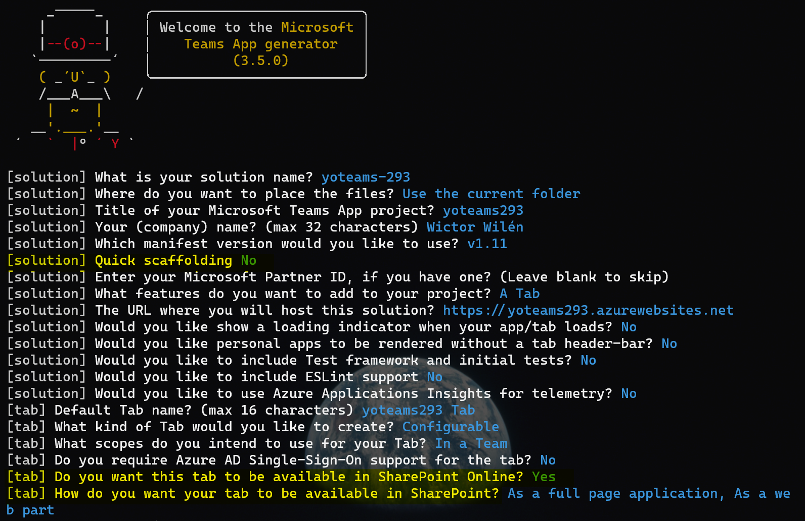
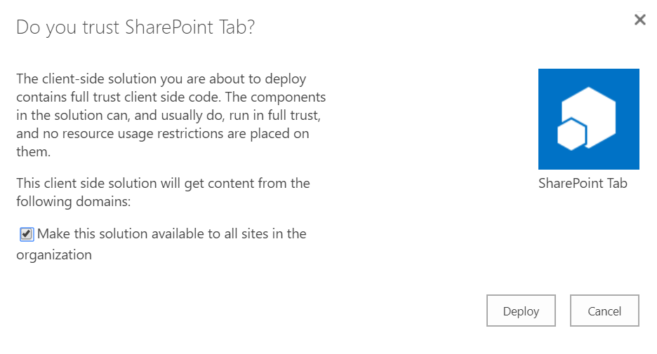
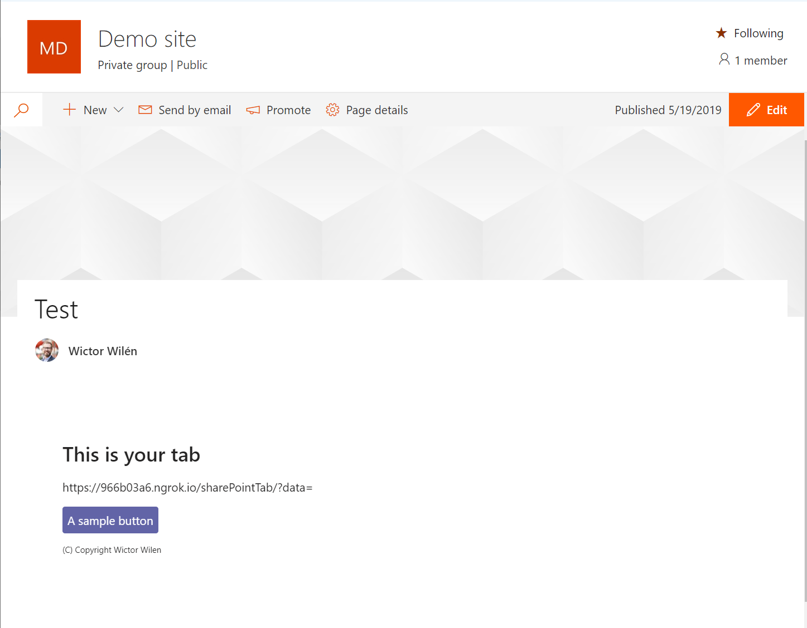

# Build a SharePoint Online Provider Hosted Web Part

> NOTE: required `generator-teams` version `2.8.0` or higher.

> NOTE: Not updated with version `3.5.0` changes

This tutorials will guide you through the steps on how to create a Microsoft Teams app with a configurable tab that you can upload to the SharePoint App Catalog and use as a web part or as a single part app page.

The use cases for this is:

* You are already building an application for Microsoft Teams and want to reuse it in SharePoint Online
* You have requirements on server side rendering or similar requirements that cannot be met with pure JavaScript and SharePoint Framework
* You're designing a web part that you want to host in an iframe in SharePoint Online.

## Generate your project

Start the Microsoft Teams App generator by invoking the `yo teams` command. Follow the instructions and input name of your solution and package. Choose a schema version that is `1.4` or higher and then select to create a *Tab*.

Fill in the URL of where you will host the application and optionally add tests and telemetry, and then type the name of your Tab - which will also be the name of your Web Part in SharePoint.

When the generator asks if you want to use *Quick Scaffolding* answer *no*. If you choose *yes* you will not be asked about SharePoint Online support and manually have to update your manifest later.

When being asked if you want the tab to be available in SharePoint - answer *yes* and then choose if you want your tab to be available as a **web part** and/or as a **full page application**. Once you have selected that the generator will scaffold your project.



## Inspect the generated code

The code is generated in the same way as in the [Build your first Microsoft Teams App tutorial](build-your-first-microsoft-teams-app.md) with the only difference being in the manifest file.

Open the manifest file (`./src/manifest/manifest.json`) and under `configurableTabs` you should see an additional two attributes: `sharePointPreviewImage` and `supportedSharePointHosts`. The first property specify a preview image (also being scaffolded into the project) to be shown for full page apps and the second attribute specifies if you want to present the Tab as a web part or a full page application, or both. 

> **NOTE**: you can modify the manifest on an existing tab project to enable support for SharePoint Online.


## Modify the code

> **NOTE**: This is a temporary workaround

Currently the `useTeams` hook will not correctly return the `context` object while hosted in SharePoint Online and you have to modify the code in the configuration React component (under `./src/client/tabname/tabnameConfig.tsx`) as done in the following example, note the else statement:

``` TypeScript
useEffect(() => {
    if (context) {
        setText(context.entityId);
        entityId.current = context.entityId;
        microsoftTeams.settings.registerOnSaveHandler(onSaveHandler);
        microsoftTeams.settings.setValidityState(true);
        microsoftTeams.appInitialization.notifySuccess();
    } else {
        microsoftTeams.initialize();
        microsoftTeams.getContext( c =>{
            setText(c.entityId);
            microsoftTeams.settings.registerOnSaveHandler(onSaveHandler);
            microsoftTeams.settings.setValidityState(true);
        });
    }
// eslint-disable-next-line react-hooks/exhaustive-deps
}, [context]);
```

## Run the application using `ngrok-serve`

For this tutorial we will use the `gulp ngrok-serve --debug` command to temporarily generate an *ngrok* public url to host your application. Note that as soon as you abort the gulp command and run it again, a new URL will be generated and you have to upload the application once again to the SharePoint App Catalog.

When you execute `gulp ngrok-serve --debug` the app will generate a random ngrok public URL and use that URL to package the manifest, into `./package/<manifest>.zip`. It will also start a local web server to host your app.

## Upload the application to the SharePoint Online App Catalog

Upload the generated manifest file (`./package/<manifest>.zip`) to the SharePoint Online App Catalog and a trust the application. Also select the checkbox to make the solution available to all site collections, and select *Deploy*.



## Add the web part to a page in SharePoint Online

Create a new Site Collection or use anyone you already have and in that site create a new page. From the Web Part gallery locate your tab/web part using the name you entered when you created the project and add it to the page.


An alternate option, if you specified that you wanted a full page experience, is when creating the new page select *Apps*, instead of a page template, and there locate your Teams Tab.

When adding the Web Part to the page you will see the Microsoft Teams Tab configuration dialog, inside of SharePoint, and you can configure your tab. Select *Save* when done. Finish the tutorial by selecting to *Publish* the page.

Your Tab is now rendered in SharePoint:


