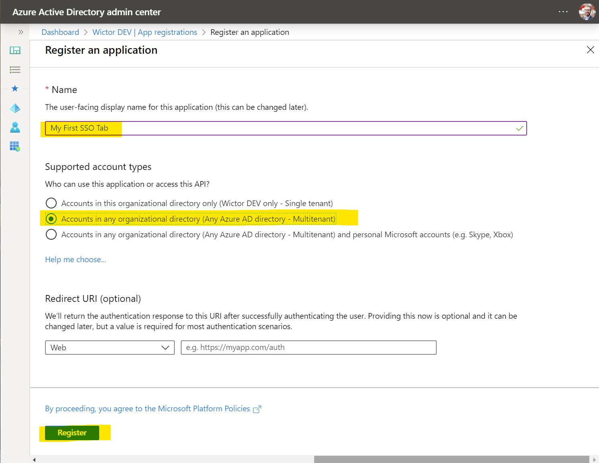
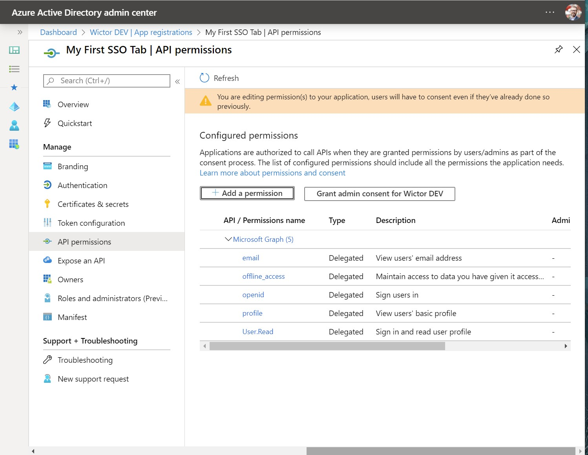
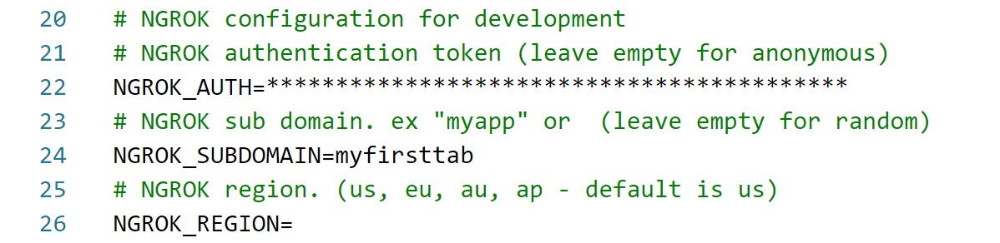

# Build a Tab with Single-Sign-On Support

> NOTE: required `generator-teams` version `2.13.0` or higher.

> NOTE: Not updated with version `3.0.0` changes

This tutorial will take you through the necessary steps and configuration that you need to to in Azure Active Directory and in Microsoft Teams in order to create a Microsoft Teams Tab single-sign-on experience.

## Preparations

Before you start configuring and scaffolding your project you need to ensure that decide on where you want to host your Microsoft Teams tab. A Tab is a web page hosted somewhere and it has to be hosted on a publicly available web site. To be able to support the Tab SSO features your Tab also has to be hosted on a well-known address, such as `https://myteamsapp.com/tab.html`. The important thing here is that the domain name can't change and you are not allowed to use any web site hosted on `azurewebsites.net` (due to security constraints).

For this tutorial we will take advantage of the paid service [ngrok](https://ngrok.com) service which allows us to proxy the HTTP calls from a well-known publicly available domain to our local server. However this is not for production builds, but the concept is the same.

## Set up your Azure AD application

The first thing that we need to do is to register a new Azure Active Directory application in the Azure AD portal, that will represent your Microsoft Teams tab. You do this by signing in to [https://aad.portal.azure.com](https://aad.portal.azure.com) using a set of credentials that is allowed to register new applications. Then navigate to *Azure Active Directory* and chose *App Registrations* in the left hand side menu.

Create a new application by clicking on *+ New registration* - on this first screen you choose the name of your application and also what *account types* you would like to support - choose any of the *Account sin any organizational directory...* options. Finally click on *Register*.



After the registration you will be redirected to the Application page where you can find the *Application (client) ID*, copy this ID into a temporary location such as notepad as you will need it shortly.


The next thing we need to do is to go to *Expose an API* and then on *Application ID URI* click on *Set*. This will allow you to configure the Application ID URI which is one of the key configurations of your SSO Tab. The Application ID URI **MUST** have the following format: `api://<your host name>/<application id>`. That is you need to use the fully qualified domain name you prepared for your tab together with the Application/Client ID to construct that Application ID URI. Microsoft Teams will verify this at runtime, so you **MUST** use your domain name in the App ID URI. If you're using test, stage and production environments you should create different Azure AD Applications for them - as an Azure AD App can only have one Application ID URI. Once set you should store this App ID URI, together with the Client ID - as we will need them when scaffolding our project later.


Next step is to expose a *Scope* and you create it by clicking at *Add a scope*. Name it `access_as_user` and choose that both *Admins and users* can consent. Then you need to write the user friendly consent display names and descriptions before clicking *Add scope*.

* `1fec8e78-bce4-4aaf-ab1b-5451cc387264` - the ID used by the Microsoft Teams desktop and mobile application
* `5e3ce6c0-2b1f-4285-8d4b-75ee78787346` - the ID use by the Microsoft Teams web application


The final configuration we need to do is to grant permissions to the Tab App registration. This is done by navigating to *API Permissions* and then click on *Add a permission*. All the permissions we need is in *Microsoft Graph*, so select that and then we also need to choose that we want to use *Delegated Permissions*. The permissions you need to select are the following:

* `User.Read` - should already be selected when the app was created
* `email`
* `offline_access`
* `openid`
* `profile`



That's it! Now we are ready to scaffold out our Teams Tab project.

## Generate your project

Start the Microsoft Teams App generator by invoking the `yo teams` command. Follow the instructions and input name of your solution and package. Choose a schema version that is `1.5` or higher and then select to create a *Tab*.

When asked about the *URL where you will host this solution* insert the exact URL you used when configuring the *Application ID URI* previously.

> Note: we can change this at a later stage by modifying the `.env` file.

Optionally add support for testing and application insights. Choose your name for the Tab and then choose to create a *Configurable* tab and choose the default options for the rest until you get to the *Do you required Azure AD Single-Sign-On support for the Tab?* then choose *Yes*.

You will now be asked first for the *Application ID* and then the *Application ID URI* that was generated when you registered the App. If you don't remember them or forgot to take a note of them - these values are always available fromt the Application registration summary page.

Finally opt-out of enabling the SharePoint Online integration by selecting No, and then wait for the project to scaffold and to install all npm packages.


## Inspect the generated code

Open up the generated project in your favorite code editor and open the manifest file (`./src/manifest/manifest.json`) and scroll down to the last few lines. You will see an addition of a new configuration there - which tells Teams that we want to use Single-Sign-On using the specified Azure AD application.

``` json
"webApplicationInfo": {
  "id": "{{SSODEMO_APP_ID}}",
  "resource": "{{SSODEMO_APP_URI}}"
}
```

> NOTE: as usual the replaceable parameters can be found in the `.env` file.

The actual tab page is found under `./src/app/scripts/<your tab name>/<your tab name>.tsx`. If you inspect this React based page you will notice that the default generated code uses the `microsoftTeams.authentication.getAuthToken()` to retrive a token when the page is loaded. If all is configured correctly this will return an *identity token* that can be used to validate the user and in the default case displaying the name of the user.

> NOTE: this token can not be used to retrieve information from for instance Microsoft Graph. In order to do so you need to implement server side support for the Azure AD on-behalf-of flow to exchange this identity token for another token.

## Run the application using `ngrok-serve`

In this demo we decided to use ngrok to create a publicly available domain and before running the Teams app we need to configure ngrok by registering the domain we specified previously - and then update the `.env` file with the ngrok subdomain as well as the ngrok auth key.



> NOTE: this registration of domains requires a paid subscription to ngrok. If you're using the free version you have to start the application using `gulp ngrok-serve` and then use the temporary domain name and update your Azure AD app registration with that.

To start the application and to generate the manifest run `gulp ngrok-serve` in the command prompt. Once the command line shows that the application is up and running you can continue with side loading the application into a newly create Microsoft Teams team.

## Sideload and test the application

Go to the Team where you want to test the application, hover over the Team icon/log and choose the Apps icon. In the lower right hand corner choose to *Upload a custom app* and choose the packaged manifest that was generated (`./package/<manifest>.zip`), and then click *Add* to finalize the side loading.

Go to a channel in your Team and choose to add a new Tab. You will find your application amongst the available tabs, choose it and follow the instructions to configure it and then click *Add*.

The Tab will now be loaded and within a few seconds you will see that the Tab will write out your name - that it retrieved from the identity token and it shows that everything is working as expected.

