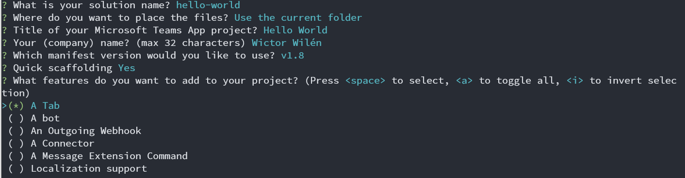
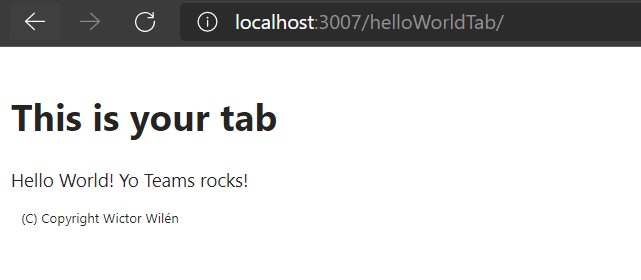
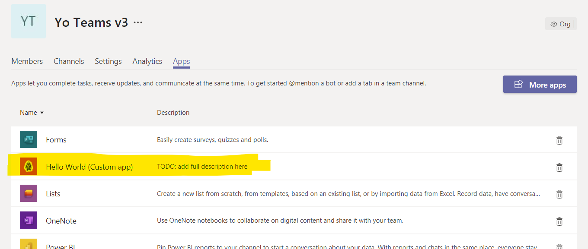

# Build your First Microsoft Teams App

> NOTE: This tutorial is adapted for `generator-teams` version `3.0.0` or higher.

In this tutorial we will walk through creating your very first Microsoft Teams app using the Microsoft Teams Yeoman generator. It assumes that you have [enabled side-loading of Microsoft Teams apps](../user-guide/setup-tenant) in Microsoft Teams as well as have installed [all the prerequisites](../user-guide/setup-machine).

## Generate your project

Open up a command prompt and create a new directory where you want to create your project and in that directory type the command `yo teams`. This will start the Teams Apps generator and you will be asked a set of questions.


The first question is about your project name, you can leave it as is by pressing enter. Next question asks you if you want to create a new directory or use the current one. As we already are in the directory we want, we just press enter.

The following step asks for a title of your project, this title will be used in the manifest and description of your app. And then you will be asked for a company name, which also will be used in the manifest.

The fifth question asks you about what version of the manifest you want to use. For this tutorial select `v1.8`, which is the current general available schema.

The next question asks you if you want to use *Quick scaffolding* - if you choose *Yes* a fewer set of questions will be asked and if you choose *No* a more advanced set of questions will follow. Choose *yes* for this tutorial.

After this the generator will ask you for what items you want to add to your project. You can select a single one or any combination of items. For now, just select *a Tab*.

Based on what items you select, you will be asked a set of follow-up questions.

Now you need to enter a URL of where you will host your solution. This can be any URL, but by default the generator suggests an Azure Web Sites URL.

The generator has a lot of built-in advanced features that you can opt-in or opt-out of, also based on your *Quick scaffolding* choice. For this tutorial choose the default options, except when being asked about support for *single-sign-on*.

Once all questions is answered the generator will scaffold the required files and finally install all the npm packages. This will take a minute or two.

## Add some code to your tab

Once the generator is done you can open up the solution in your favorite code editor. Take a minute or two and familiarize yourself with how the code is organized - you can read more about that in the [Project Structure](../concepts/project-structure.md) documentation.

Your Tab will be located in the `./src/client/helloWorldTab/HelloWorldTab.tsx` file. This is the TypeScript React based functional component for your Tab. Locate the `return` statments and replace the code inside the second `<Flex.Item>` control so it looks like this:

``` TypeScript
<Flex.Item>
    <div>
    Hello World! Yo Teams rocks!
    </div>
</Flex.Item>
```

Save the file and return to the command prompt.

## Build your app

You can now build your project. This is done in two steps (or one step, see below).

First you need to create the Teams App manifest file, that you upload/sideload into Microsoft Teams. This is done by the Gulp task `gulp manifest`. This will validate the manifest and create a zip file in the `./package` directory.

To build your solution you use the `gulp build` command. This will transpile your solution into the `./dist` folder.

## Run your app

To run your app you use the `gulp serve` command. This will build and start a local web server for you to test your app. The command will also rebuild the application whenever you save a file in your project.

You should now be able to browse to `http://localhost:3007/helloWorldTab/` to ensure that your tab is rendering. However, not in Microsoft Teams yet.


## Run your app in Microsoft Teams

Microsoft Teams does not allow you to have your app hosted on localhost, so you need to either publish it to a public URL or use a proxy such as ngrok.

Good news is that the scaffolded project has this built-in. When you run `gulp ngrok-serve` the ngrok service will be started in the background, with a unique and public DNS entry and it will also package the manifest with that unique URL and then do the exact same thing as `gulp serve`.

After running `gulp ngrok-serve`, create a new Microsoft Teams team and when it is created click on the Team name, to go to the teams settings and then select *Apps*. In the lower right corner you should see a link *Upload a custom app*, select it and then browse to your project folder and the subfolder called `package`. Select the zip file in that folder and choose open. Your App is now sideloaded into Microsoft Teams.


Go back to the *General* channel and select *+* to add a new Tab. You should see your tab in the list of tabs.

Choose your tab and follow the instructions to add it. Notice that you have a custom configuration dialog, for which you can edit the source. Select *Save* to add your tab to the channel. Once done your tab should be loaded inside Microsoft Teams!


**Congrats! You built and deployed your first Microsoft Teams App**

**Yo Teams**
